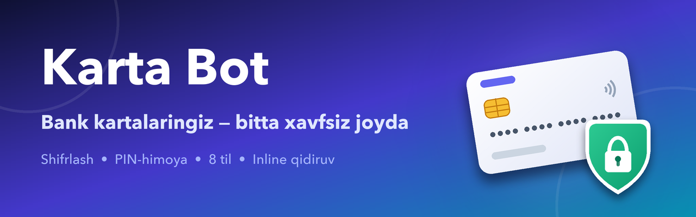

<p align="center">
  
</p>

# 💳 Karta Bot

Bank kartalari ma'lumotlarini xavfsiz saqlash va tez topish uchun mo'ljallangan Telegram bot. Karta raqamlari shifrlab saqlanadi, kirish esa PIN-kod bilan himoyalanadi.

## ✨ Imkoniyatlar

- **🔐 Shifrlash** — karta raqamlari bazaga Fernet (AES) bilan shifrlab yoziladi, ochiq holda saqlanmaydi
- **📌 PIN-himoya** — kartalarni ko'rishdan oldin PIN so'raladi; 5 marta xato kiritilsa vaqtincha bloklanadi (brute-force himoyasi)
- **🌍 8 til** — o'zbekcha (lotin/kirill), ruscha, inglizcha, qozoqcha, tojikcha, turkcha, qirg'izcha
- **➕ To'liq boshqaruv** — karta qo'shish, tahrirlash (nomi, raqami, egasi), o'chirish
- **🔎 Inline qidiruv** — kartalarni istalgan chatda `@bot_username` orqali topish va yuborish
- **💾 Zaxira nusxa** — kartalarni eksport/import qilish
- **🛡️ Barqarorlik** — ushlanmagan xatolar botni yiqitmaydi, jurnalga yoziladi

## 🧰 Texnologiyalar

| Komponent | Vosita |
|-----------|--------|
| Framework | [aiogram 3](https://docs.aiogram.dev/) |
| Baza | SQLite (`aiosqlite`) |
| Shifrlash | `cryptography` (Fernet) |
| Sozlamalar | `python-dotenv` |

## 🚀 O'rnatish

### 1. Loyihani yuklab olish

```bash
git clone https://github.com/Ibrohim-Qobilov/karta-bot.git
cd karta-bot
```

### 2. Virtual muhit va kutubxonalar

```bash
python -m venv venv
source venv/bin/activate      # Windows: venv\Scripts\activate
pip install -r requirements.txt
```

### 3. Sozlamalar (`.env`)

`.env.example` dan nusxa oling:

```bash
cp .env.example .env
```

So'ng `.env` faylini to'ldiring:

```env
BOT_TOKEN=@BotFather bergan token
ENCRYPTION_KEY=Fernet kaliti
DB_PATH=cards.db
```

Fernet kalitini hosil qilish:

```bash
python -c "from cryptography.fernet import Fernet; print(Fernet.generate_key().decode())"
```

> ⚠️ `ENCRYPTION_KEY` ni o'zgartirmang — kalit yo'qolsa yoki almashsa, saqlangan kartalarni deshifrlab bo'lmaydi.

### 4. Ishga tushirish

```bash
python main.py
```

### 5. Bot profilini rasmiylashtirish (ixtiyoriy)

```bash
python set_bot_info.py   # nom va tavsiflarni 8 tilda o'rnatadi
```

Profil rasmi, tavsif rasmi va to'liq yo'riqnoma: [BOTFATHER.md](BOTFATHER.md)

## 💬 Buyruqlar

| Buyruq | Vazifasi |
|--------|----------|
| `/start` | Botni ishga tushirish va til tanlash |
| `/karta` yoki `/card` | Kartalar ro'yxati |
| `/add` | Yangi karta qo'shish |
| `/security` yoki `/privacy` | Xavfsizlik / maxfiylik siyosati |

## 📁 Loyiha tuzilishi

```
karta_bot/
├── main.py            # Botni ishga tushirish
├── config.py          # .env dan sozlamalarni o'qish
├── states.py          # FSM holatlari
├── set_bot_info.py    # BotFather nom/tavsiflarini 8 tilda o'rnatish
├── assets/            # Bot rasmi, banner (generate.py bilan yaratilgan)
├── database/          # SQLite bilan ishlash, shifrlash
├── handlers/          # Buyruq va tugma ishlovchilari
├── keyboards/         # Telegram klaviaturalari
├── locales/           # 8 til uchun matnlar
├── utils/             # Yordamchi funksiyalar
└── tests/             # Testlar
```

## 🔒 Xavfsizlik

- Karta raqamlari **hech qachon ochiq saqlanmaydi** — faqat shifrlangan holda
- PIN-kod **sha256 + user_id tuz** bilan hashlanadi, ochiq saqlanmaydi
- `.env` va `*.db` fayllari `.gitignore` orqali repozitoriyga tushmaydi

📄 To'liq maxfiylik siyosati: [telegra.ph/Karta-Bot--Maxfiylik-siyosati-07-11](https://telegra.ph/Karta-Bot--Maxfiylik-siyosati-07-11)
🛡️ Texnik xavfsizlik hujjati: [SECURITY.md](SECURITY.md)

## 📝 Litsenziya

Shaxsiy foydalanish uchun.
